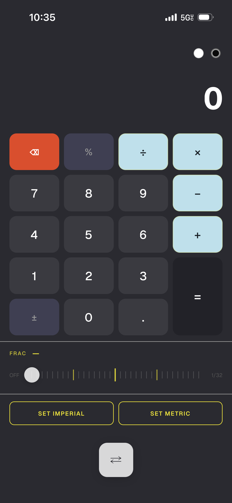
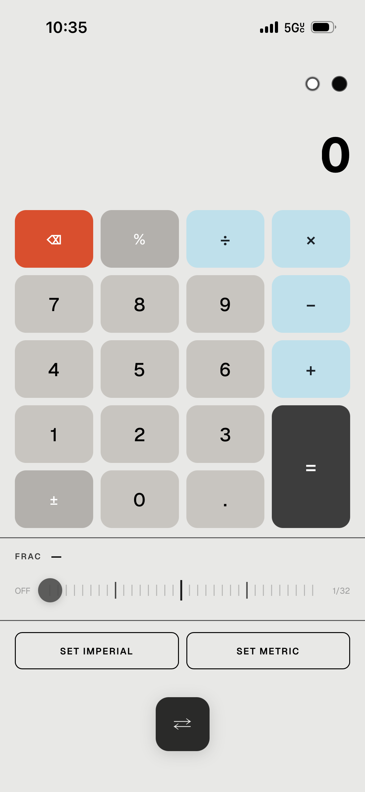
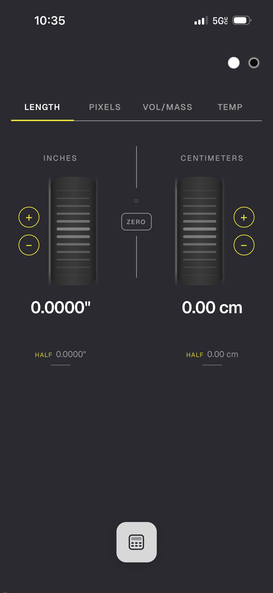
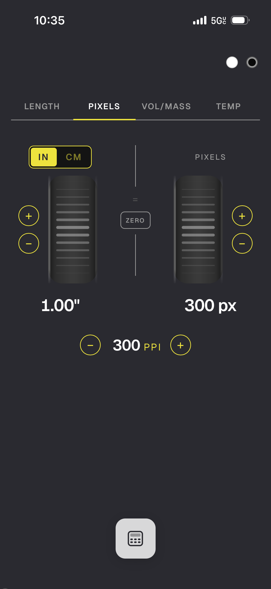
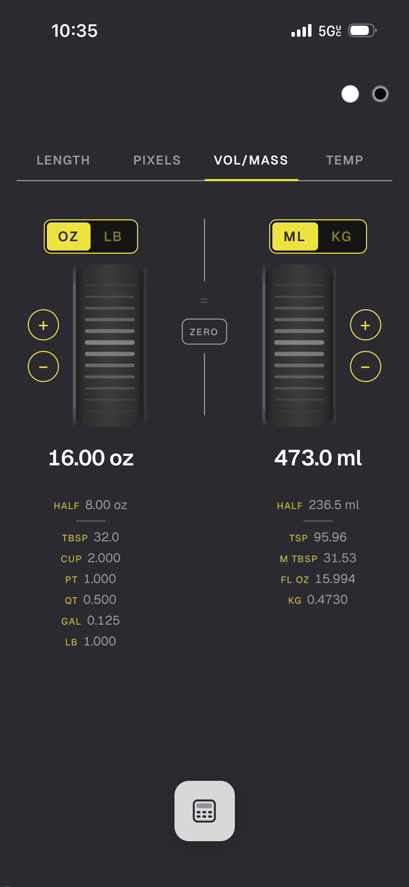
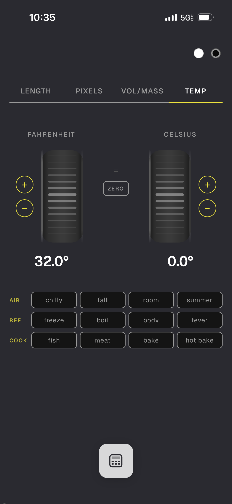

# CALC\*ON

A Sumlock-style running total calculator with fraction input and memory recall. The converter runs on two scroll wheels — tactile and intuitive on mobile, with hotkeys and keyboard input for desktop.

---

  
  

  
  
  
  

---

## Features

**Converter**
- **Length** — inches ↔ centimeters, with fraction, half, and feet sub-info
- **Pixels** — inches or cm ↔ pixels at adjustable PPI (72–600)
- **Vol/Weight** — oz/lb ↔ ml/kg, with tablespoon, cup, pint, quart, gallon, and metric equivalents
- **Temp** — °F ↔ °C, with air, reference, and cook presets

**Calculator**
- Standard arithmetic with a fraction slider (1/32 increments)
- Memory bank — stores up to 8 values, tap to recall
- **SET IMPERIAL** / **SET METRIC** — sends calculator result directly to the converter

**Design**
- Light and Dark color modes
- Fully self-contained single HTML file — no server, no dependencies at runtime
- Works offline once loaded
- Responsive — full width on mobile, 55% centered column on desktop

---

## Keyboard Shortcuts

### Anywhere
| Key | Action |
|-----|--------|
| `C` | Toggle between Calculator and Converter |
| `W` | Cycle color themes (Light → Dark) |

### Converter (calculator closed)
| Key | Action |
|-----|--------|
| `→` | Next converter mode |
| `←` | Previous converter mode |
| `0–9` | Type digits into left wheel |
| `Backspace` | Remove last digit from left wheel |
| `Z` | Zero both wheels |

### Calculator
| Key | Action |
|-----|--------|
| `0–9`, `.` | Number input |
| `-` | Minus |
| `=` or `+` | Plus |
| `X` or `*` | Multiply |
| `/` | Divide |
| `Enter` | Equals |
| `Backspace` or `Delete` | Delete last digit |
| `Z` | Clear everything |
| `%` | Percent |
| `M` | Set Metric → switch to converter |
| `I` | Set Imperial → switch to converter |
| `Cmd/Ctrl + C` | Copy current result |

---

## Add to iPhone Home Screen

One of the best ways to use Calc\*on is straight from your iPhone home screen. It eliminates the browser UI entirely — no address bar, no tabs — and just gives you the app full screen, exactly as it was designed to be used.

1. Open Calc\*on in **Safari** on your iPhone
2. Tap the **Share** button (the box with the arrow pointing up) at the bottom of the screen
3. Scroll down and tap **"Add to Home Screen"**
4. Give it a name and tap **Add**

It'll sit on your home screen like any other app. Great for quick lookups on the job.

---

## Built with

- Vanilla JS — no framework
- [Geist](https://fonts.google.com/specimen/Geist) via Google Fonts
- SVG scroll wheels with physics-based ridge animation
- Vibration API for haptic feedback on supported devices (Android Chrome)

---

## License

This project is licensed under the [GNU General Public License v3.0](https://www.gnu.org/licenses/gpl-3.0.en.html).  
You are free to use, modify, and distribute this software under the same license terms.

---

## Author

Christopher Cunningham  
[github.com/christophcunningham](https://github.com/christophcunningham)
